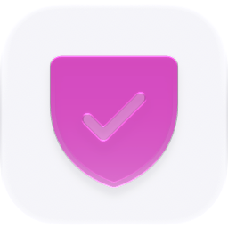
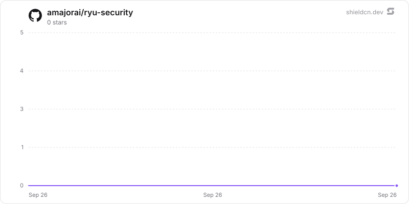

<p align="center">
  <picture>
    <source media="(prefers-color-scheme: dark)" srcset="./icon-dark.png" />
    
  </picture>
</p>

<div align="center">

# Security

</div>

A local-first application security workbench: review authorized repositories, inspect bounded findings, and prepare read-only remediation proposals.

> **The public home of `ryu-security`.** Source, builds, and releases live here —
> binaries for every platform are attached to each release.
>
> This tree is generated from the Ryu monorepo, so commits pushed here
> directly are replaced on the next sync. **Pull requests are welcome** —
> open them here and they are ported into the monorepo, then flow back out.
> Ryu as a whole: https://github.com/amajorai/ryu

## Install

**App:** [Install](ryu://apps/@ryu/security) (opens the Ryu desktop app and asks you to confirm)

**CLI:**

```bash
ryu apps add @ryu/security
```

## Source & build

This satellite carries the Rust coordinator backend plus the Companion UI.
The backend builds with Cargo; the UI imports Ryu's private `@ryu/ui`
design system and is shipped as the prebuilt `dist/index.html` bundle.

## License

Apache-2.0 — see [LICENSE](./LICENSE).

## Surface

- **Scans** — start standard, deep, or change-oriented local reviews; follow
  phase progress; inspect coverage and findings.
- **Findings** — search saved findings, review source location and attack path,
  record triage, and generate a read-only patch proposal.
- **Repositories** — inspect repository identity, last scanned revision, and
  recent scan history.

The app deliberately leaves hosted cloud workers, browser/device capture,
provider-backed model review, and patch application to separately governed Ryu
capabilities. Those capabilities are never represented as local success.

## Build and test

```sh
bun run --cwd apps-store/security/ui build
bun run --cwd apps-store/security/ui check-types
bun test --cwd apps-store/security/ui
cargo test --manifest-path apps-store/security/backend/Cargo.toml
```

The UI builds to one self-contained `dist/index.html` for the Companion. In a
hosted app, the UI calls the sidecar through the generic `app:http` bridge; local
development uses the Vite proxy documented in `ui/vite.config.ts`.

## Star History

<a href="https://github.com/amajorai/ryu-security/stargazers">
  <picture>
    <source media="(prefers-color-scheme: dark)" srcset="./.github/shieldcn/star-chart-dark.svg" />
    
  </picture>
</a>
